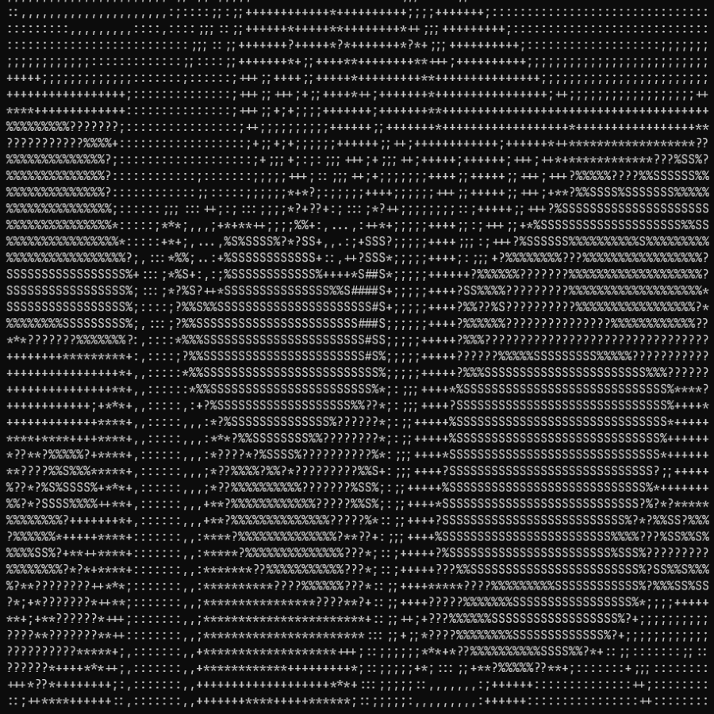
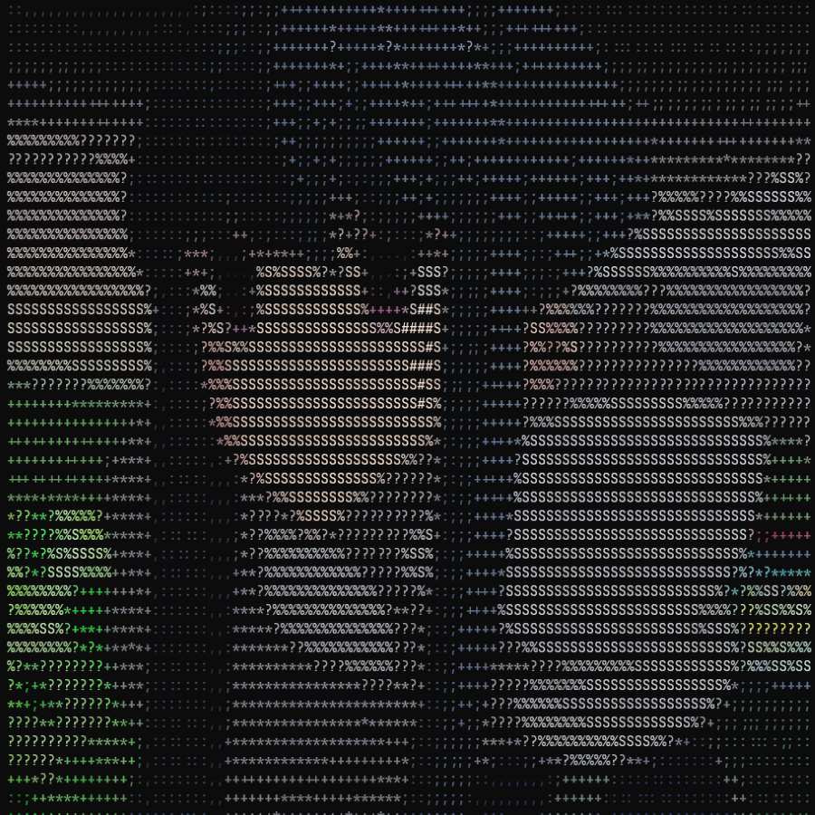

<p align="center"></p>

<h1 align="center">Tapciify</h1>

<p align="center">CLI tool that can let you view images in terminal as ASCII art</p>

## Requirements

1. CC linker (Windows - Microsoft Visual Studio with C++ Support) (Linux - gcc)

2. [Rust](https://www.rust-lang.org/tools/install)

## Install

```bash
cargo install tapciify
```

## View image

1. Run: `tapciify -i imagePath -w imageWidth` for image.

2. Run: `tapciify -i imagePath -w imageWidth -r` for reversed colors.

## View video

In this example I set framerate to 24 (but you can use any another)

> Requires ffmpeg

1. Make frames from video into dir:

```bash
mkdir frames; ffmpeg -i badapple.mkv -r 24 frames/%08d.jpeg
```

2. Run:

```bash
tapciify -i frames/* -w videoWidth -f 24
```

## Examples

| Original                                               | ASCII                                      | ASCII colored                                    |
| ------------------------------------------------------ | ------------------------------------------ | ------------------------------------------------ |
|                  |            |  |
| `Original image (Shima Rin from Laid-Back Camp manga)` | `tapciify -i ./assets/original.png -w 100` | `tapciify -i ./assets/original.png -w 100 -c`    |
