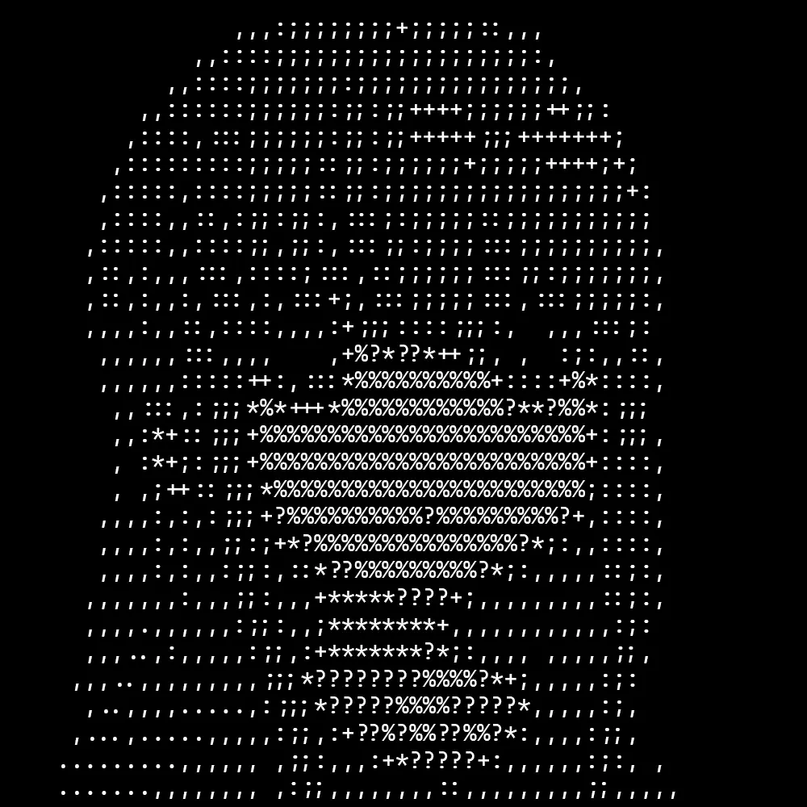
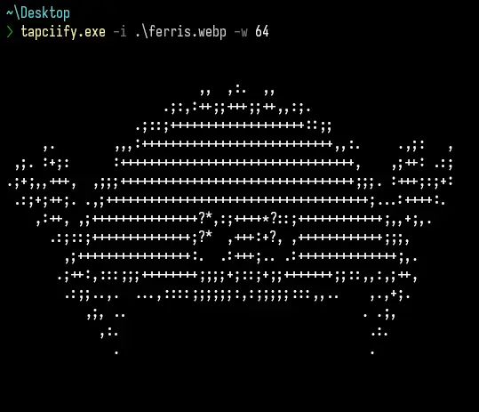
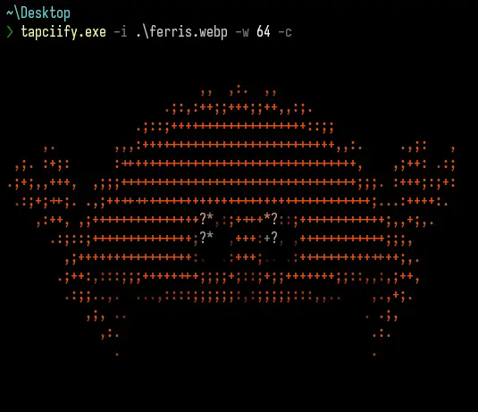
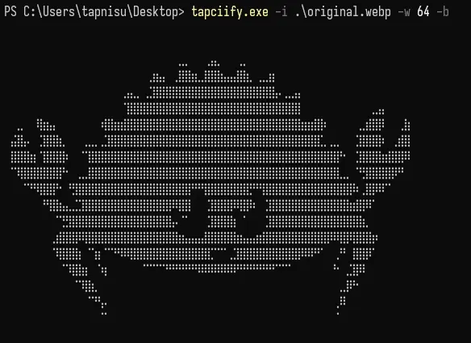
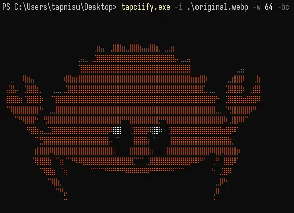
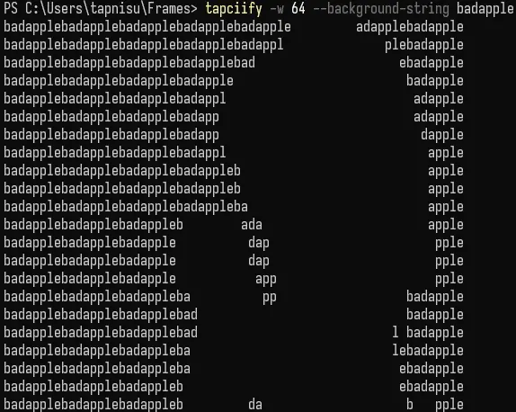

<p align="center"></p>
<h1 align="center">Tapciify</h1>
<p align="center">CLI tool that can let you view images in terminal as ASCII art</p>

## Requirements

1. CC linker (Windows - Microsoft Visual Studio with C++ Support) (Linux - gcc)

2. [Rust](https://www.rust-lang.org/tools/install)

## Installation

```bash
cargo install tapciify
```

## Converting image

1. Run: `tapciify -i imagePath -w imageWidth` for image.

2. Run: `tapciify -i imagePath -w imageWidth -r` for reversed colors.

## Converting video

In this example I set framerate to 24 (but you can use any another)

> Requires ffmpeg

1. Make frames from video into dir:

   ```bash
   mkdir frames; ffmpeg -i bad_apple.mkv frames/%08d.jpeg
   ```

2. Run:

   ```bash
   tapciify -i frames/* -w videoWidth -f 24
   ```

## Examples

| Original                                       | ASCII                                             | ASCII colored                                            | Pixels                                                                  | Braille                                              | Braille colored                                          | Background string                                                                 |
|------------------------------------------------|---------------------------------------------------|----------------------------------------------------------|-------------------------------------------------------------------------|------------------------------------------------------|----------------------------------------------------------|-----------------------------------------------------------------------------------|
|  |           |  |  |              |  |                       |
| `Original image`                               | `tapciify -i ./assets/examples/ferris.webp -w 64` | `tapciify -i ./assets/examples/ferris.webp -w 64 -c`     | `tapciify -i ./assets/examples/ferris.webp -w 64 --pixels`              | `tapciify -i ./assets/examples/ferris.webp -w 64 -b` | `tapciify -i ./assets/examples/ferris.webp -w 64 -bc`    | `tapciify -i ./assets/examples/bad-apple.webp -w 64 --background-string badapple` |
